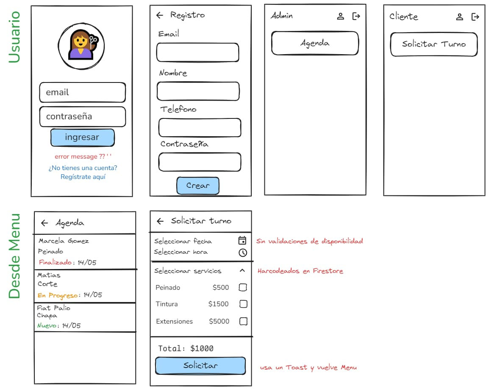
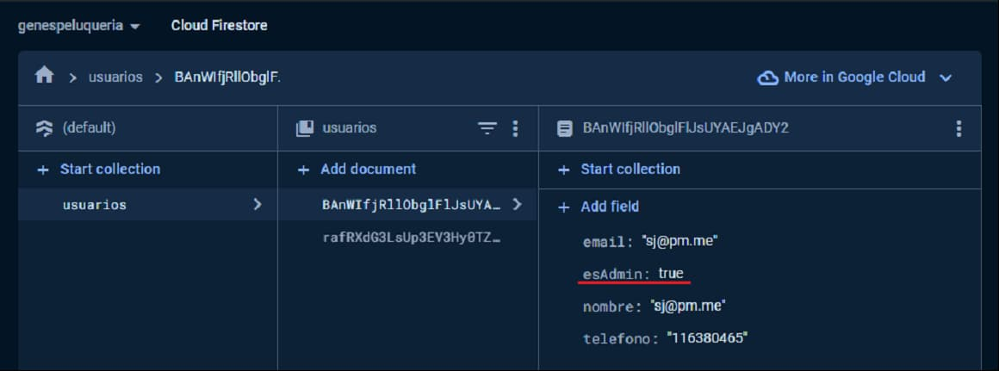
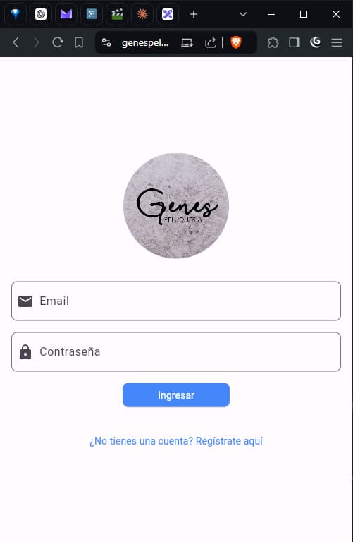
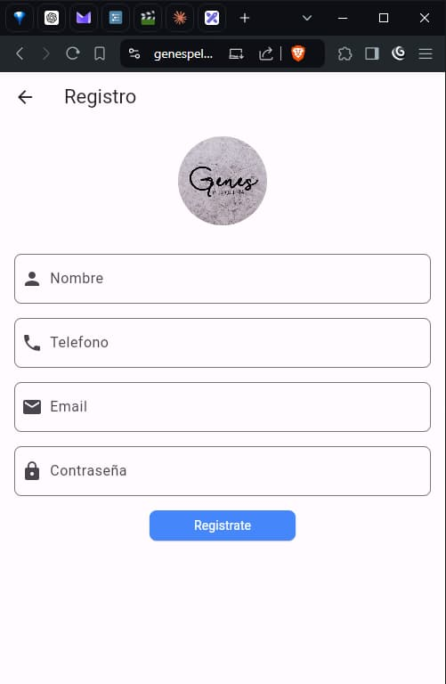
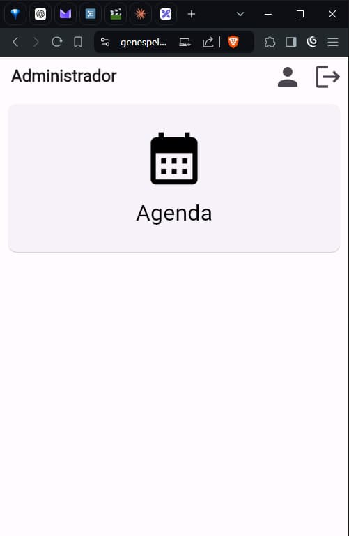
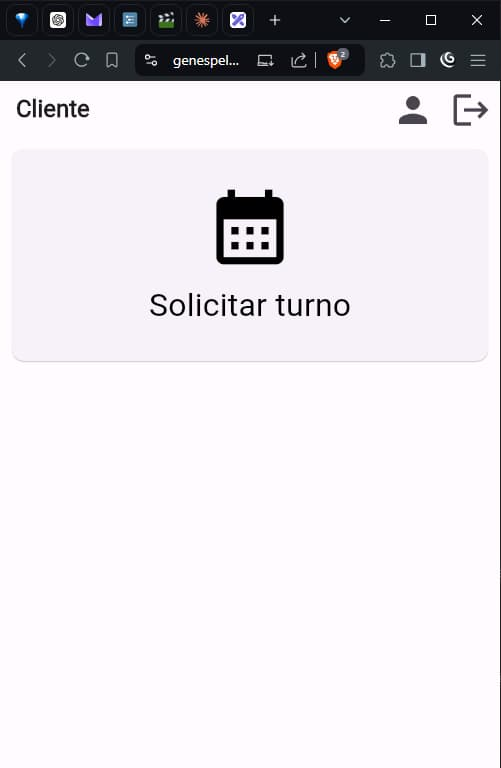

# Genes Peluqueria
> 💇‍♀️ lorem ipsum

- [drive](https://drive.google.com/drive/folders/1FLuEEXDTOg4YhkYT3M8GFzDY0F9UuOwb): plantillas y entregas
- [excalidraw](https://excalidraw.com/#room=d09e1181ba48f077258c,0zNHoBR1Pr9vPYAQqW1FMg): mockup
- [repo](https://github.com/danielazim13/genespeluqueria)
- [live](https://genespeluqueria-44526.web.app/)
- [github projects](https://github.com/users/danielazim13/projects/1): kanban
- [firebase](https://console.firebase.google.com/u/0/project/genespeluqueria-44526/overview): backend
- links utiles
    - [material icons](https://fonts.google.com/icons)
    - [adbrepo/curso_flutter](https://github.com/adbrepo/curso_flutter)

## para terminar el mpv falta lo siguiente
- [ ] turno
    - [ ] pedir turno (cliente)
    - [ ] ver agenda (lista de turnos) (admin)
- [ ] config
    - [x] instala y configura dependencias (firebase, riverpod, go_router, etc)
    - [x] configura firebase auth y store
    - [ ] website deployment: fix ci
- [x] usuario
    - [x] login
    - [x] registro
    - [x] edit
- [x] menus
    - [x] cliente
    - [x] administrador
- [ ] chiches
    - [ ] theme
    - [ ] riverpod: theme switch
    - [ ] riverpod: `/register` wizard
    - [ ] firebase storage: foto de perfil
    - [ ] firebase functions: algo para probar
- [ ] documentar

## como hacer una cuenta administrador

cambialo desde cloudstore

## screenshots

<table>
  <tr>
    <td></td>
    <td></td>
  </tr>
  <tr>
    <td></td>
    <td></td>
  </tr>
</table>

## log
- 2024-09-01:
    - configuracion: el repo, integracion firebase
    - planificacion: el mockup, un board tipo kanban
    - implementacion: un esqueleto de screens con:
        - login, registro, menu admin, menu cliente
    - falta:
        - la feature mas importante: pedir turno
        - estaria bueno: theme, riverpod
